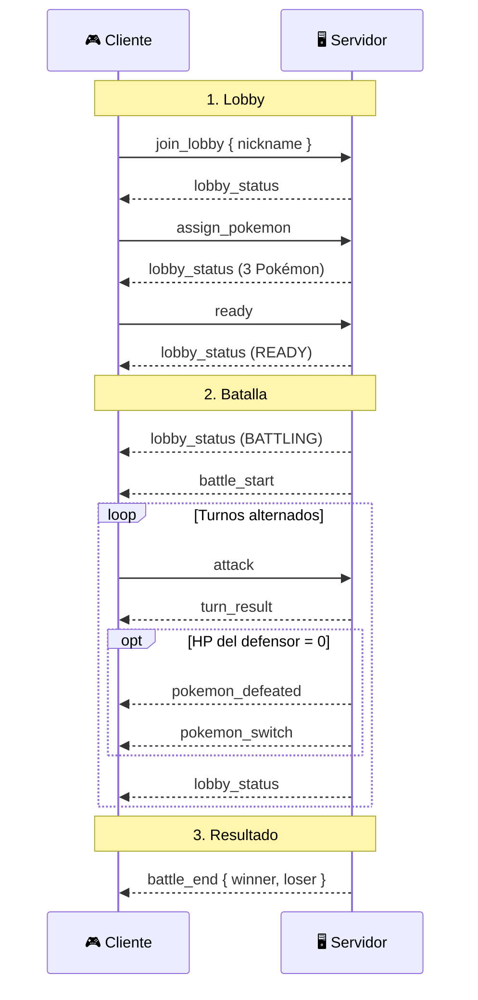

# Pokémon Stadium Lite

> Real-time battle API — Node.js · Socket.IO · MongoDB

<div align="center">


</div>

API backend en tiempo real para batallas Pokémon 1v1. Dos jugadores se conectan, reciben equipos aleatorios, y se enfrentan por turnos con efectividad de tipos. Todo persiste en MongoDB y el flujo de batalla corre sobre WebSockets.

[Inicio Rápido](#-inicio-rápido) · [Arquitectura](#-arquitectura) · [API REST](#-api-rest) · [WebSocket](#-eventos-websocket) · [ADR](#-architecture-decision-records) · [Docker](#-docker)

<br />

## ⚡ Características

| Característica              | Descripción                                                         |
| :-------------------------- | :------------------------------------------------------------------ |
| **Batallas en tiempo real** | Turnos 1v1 vía Socket.IO con mutex anti-race condition              |
| **Efectividad de tipos**    | Daño basado en tabla oficial de tipos (15 tipos, 3 multiplicadores) |
| **Lobby automático**        | El primer jugador crea el lobby, el segundo se une                  |
| **Equipo aleatorio**        | 3 Pokémon aleatorios por jugador, sin repetición                    |
| **Registro de jugadores**   | Validación de nickname + tracking de stats                          |
| **Leaderboard**             | Ranking por win rate con historial de batallas                      |
| **Swagger UI**              | Docs interactivas en `/docs`                                        |
| **Trace ID**                | Trazabilidad end-to-end en HTTP y WebSocket                         |
| **Docker ready**            | `docker compose up` levanta API + MongoDB                           |

<br />

## 🛠 Tech Stack

<div align="center">

**Runtime & Frameworks**


**Infraestructura**


</div>

| Dependencia   | Versión | Propósito                                   |
| :------------ | :-----: | :------------------------------------------ |
| **Fastify**   |   5.8   | Servidor HTTP + Swagger                     |
| **Socket.IO** |   4.8   | Comunicación bidireccional en tiempo real   |
| **Mongoose**  |   9.3   | ODM con validación a nivel schema           |
| **Pino**      |  10.3   | Logging estructurado de alta performance    |
| **Zod**       |   4.3   | Validación de env vars y payloads WebSocket |
| **Vitest**    |   4.0   | Testing unitario e integración              |

<br />

---

## 🚀 Inicio Rápido

### Prerequisitos

- Node.js >= 22
- pnpm >= 10
- MongoDB 7+ (o usar Docker)

### Instalación local

```bash
git clone <repo-url>
cd pokemon-stadium-api
pnpm install

cp .env.example .env
# Editar .env con tus valores

pnpm dev        # Desarrollo con hot-reload
pnpm test       # Ejecutar tests
```

### Con Docker (recomendado)

```bash
docker compose up --build
```

Levanta la API en `http://localhost:8080` y MongoDB en `localhost:27017`.

| URL                                | Descripción  |
| :--------------------------------- | :----------- |
| `http://localhost:8080/docs`       | Swagger UI   |
| `http://localhost:8080/api/health` | Health check |

<br />

---

## ⚙️ Variables de Entorno

| Variable               | Descripción                | Default       | Requerida |
| :--------------------- | :------------------------- | :------------ | :-------: |
| `PORT`                 | Puerto del servidor        | `8080`        |    No     |
| `HOST`                 | Host de escucha            | `0.0.0.0`     |    No     |
| `MONGODB_URI`          | URI de conexión a MongoDB  | —             |    Sí     |
| `POKEMON_API_BASE_URL` | URL base de la API externa | —             |    Sí     |
| `NODE_ENV`             | Entorno de ejecución       | `development` |    No     |

<br />

---

## 🏗 Arquitectura

El proyecto sigue **Clean Architecture** con tres capas bien definidas. La regla de dependencia es estricta: las capas internas nunca conocen a las externas.

```
╔══════════════════════════════════════════════════════════╗
║                     INFRASTRUCTURE                       ║
║                                                          ║
║   HTTP (Fastify)    WebSocket (Socket.IO)    MongoDB     ║
║   PokemonAPI        Pino Logger              EventBus    ║
╠══════════════════════════════════════════════════════════╣
║                      APPLICATION                         ║
║                                                          ║
║   Use Cases    DTOs    Listeners                         ║
╠══════════════════════════════════════════════════════════╣
║                         CORE                             ║
║                                                          ║
║   Entities    Interfaces    Errors    Events    Enums    ║
╚══════════════════════════════════════════════════════════╝
```

### Core (Dominio)

Cero dependencias externas. Define **qué** hace el sistema:

- **Entities** — `Lobby`, `Player`, `Pokemon`, `Battle`, `PlayerStats`
- **Interfaces** — Contratos: `ILobbyRepository`, `IBattleRepository`, `IPokemonApiService`, `ITurnLock`
- **Errors** — Tipados por dominio: `LobbyFullError`, `NotYourTurnError`, etc.
- **Events** — `BattleFinishedEvent` para comunicación desacoplada
- **typeEffectiveness** — Tabla de 15 tipos con multiplicadores

### Application (Casos de Uso)

Orquesta la lógica. Define **cómo** se ejecutan las operaciones:

| Use Case            | Responsabilidad                             |
| :------------------ | :------------------------------------------ |
| `RegisterPlayer`    | Validar nickname y registrar jugador        |
| `JoinLobby`         | Crear lobby o unir segundo jugador          |
| `AssignPokemon`     | Asignar 3 Pokémon aleatorios sin repetir    |
| `PlayerReady`       | Marcar ready, transicionar READY → BATTLING |
| `ExecuteAttack`     | Daño con tipos, turnos alternados + mutex   |
| `SwitchPokemon`     | Cambiar Pokémon activo (consume turno)      |
| `GetPokemonCatalog` | Catálogo desde API externa con cache        |
| `GetLeaderboard`    | Ranking por win rate                        |
| `GetPlayerHistory`  | Stats y batallas de un jugador              |

**Listeners** (eventos de dominio):

| Listener            | Trigger          | Acción                |
| :------------------ | :--------------- | :-------------------- |
| `ResetLobby`        | `BattleFinished` | Limpia el lobby       |
| `UpdateLeaderboard` | `BattleFinished` | Actualiza wins/losses |

### Infrastructure (Implementaciones)

Adaptadores concretos. Define **con qué** se conecta:

- **MongoDB** — Schemas con validación + índices + 3 repos
- **HTTP** — Fastify + Swagger + traceId + errorHandler
- **WebSocket** — Socket.IO + handlers por dominio + error boundary
- **External** — PokemonApiService + cache en MongoDB
- **Logger** — Pino con child loggers contextuales
- **Locks** — Mutex in-memory para atomicidad de turnos

<br />

---

## 💾 Persistencia

### Validaciones a nivel schema

| Schema      | Campo                              | Validación         | Motivo                |
| :---------- | :--------------------------------- | :----------------- | :-------------------- |
| Pokemon     | `hp`, `attack`, `defense`, `speed` | `min: 0`           | Stats no negativos    |
| Pokemon     | `maxHp`                            | `min: 1`           | Siempre al menos 1 HP |
| Pokemon     | `type`                             | `length > 0`       | Mínimo un tipo        |
| Player      | `nickname`                         | `1-20 chars, trim` | Longitud controlada   |
| Player      | `team`                             | `length <= 3`      | Máximo 3 Pokémon      |
| Player      | `activePokemonIndex`               | `0-2`              | Índice válido         |
| Lobby       | `players`                          | `length <= 2`      | Máximo 2 jugadores    |
| Lobby       | `currentTurnIndex`                 | `0-1`              | Solo 2 jugadores      |
| Battle      | `status`                           | `enum`             | Solo estados válidos  |
| Battle      | `damage`                           | `min: 0`           | Daño no negativo      |
| PlayerStats | `winRate`                          | `0-1`              | Porcentaje válido     |

### Índices

| Collection  | Índice                 | Tipo      | Justificación                   |
| :---------- | :--------------------- | :-------- | :------------------------------ |
| lobbies     | `status`               | Simple    | `findActive()` en cada acción   |
| battles     | `nickname + startedAt` | Compuesto | Historial por jugador           |
| battles     | `status`               | Simple    | Batallas activas                |
| battles     | `startedAt`            | Simple    | Orden cronológico               |
| playerstats | `nickname`             | Unique    | Lookup + unicidad               |
| playerstats | `winRate + wins`       | Compuesto | Leaderboard sin sort en memoria |

<br />

---

## 📜 Reglas de Dominio

**Lobby** — máquina de estados:

```
WAITING ──→ READY ──→ BATTLING ──→ FINISHED
```

**Player** — máquina de estados:

```
JOINED ──→ TEAM_ASSIGNED ──→ READY ──→ BATTLING
```

**Batalla:**

- **Primer turno**: Pokémon activo con mayor `speed`
- **Fórmula de daño**: `floor((ATK - DEF) × typeMultiplier)`, mínimo 1
- **Efectividad**: 1.5× super efectivo · 0.5× no efectivo · 0× inmune
- **HP**: nunca baja de 0
- **Auto-switch**: al caer un Pokémon, el siguiente vivo entra
- **Victoria**: cuando el equipo completo rival es derrotado
- **Forfeit**: desconexión = derrota automática
- **Race conditions**: mutex in-memory bloquea durante procesamiento de turno
- **Auditoría**: cada turno se persiste en `Battle.turns` con datos completos

<br />

---

## 📂 Estructura del Proyecto

```
src/
├── core/                             # Dominio puro (sin deps externas)
│   ├── entities/                     #   Lobby, Player, Pokemon, Battle, PlayerStats
│   ├── enums/                        #   LobbyStatus, PlayerStatus, PokemonType
│   ├── errors/                       #   BusinessError + errores específicos
│   ├── events/                       #   DomainEvent, BattleFinishedEvent
│   ├── interfaces/                   #   Contratos: repos, services, logger
│   └── typeEffectiveness.ts          #   Tabla de efectividad de tipos
│
├── application/                      # Casos de uso y DTOs
│   ├── use-cases/                    #   RegisterPlayer, JoinLobby, ExecuteAttack...
│   ├── dtos/                         #   LobbyDTO, TurnResultDTO, BattleEndDTO
│   └── listeners/                    #   ResetLobby, UpdateLeaderboard
│
├── infrastructure/                   # Implementaciones concretas
│   ├── database/mongo/               #   Schemas + Repositories
│   ├── http/                         #   Fastify, rutas, middlewares
│   ├── websocket/                    #   Socket.IO handlers, registry
│   ├── external/                     #   PokemonApiService + cache
│   ├── events/                       #   EventBus (EventEmitter)
│   ├── locks/                        #   InMemoryTurnLock (mutex)
│   └── logger/                       #   PinoLogger
│
├── config/
│   └── env.ts                        # Validación con Zod
│
└── main.ts                           # Composition root

tests/
├── fakes/                            # Implementaciones in-memory
│   ├── FakeLobbyRepository.ts
│   ├── FakeBattleRepository.ts
│   ├── FakePlayerRepository.ts
│   ├── FakePokemonApiService.ts
│   ├── FakeEventBus.ts
│   ├── FakeTurnLock.ts
│   └── SilentLogger.ts
├── battle-flow.test.ts               # 25 tests de batalla
└── register-player.test.ts           # 8 tests de registro
```

<br />

---

## 🌐 API REST

Formato estándar de respuesta con trazabilidad:

```json
{
  "success": true,
  "data": { "..." },
  "error": null,
  "traceId": "550e8400-e29b-41d4-a716-446655440000",
  "timestamp": "2026-03-11T19:00:00.000Z"
}
```

### Endpoints

| Método | Endpoint                         | Descripción                    |
| :----: | :------------------------------- | :----------------------------- |
| `POST` | `/api/players/register`          | Registrar jugador por nickname |
| `GET`  | `/api/pokemon`                   | Catálogo de Pokémon (Gen 1)    |
| `GET`  | `/api/leaderboard?limit=10`      | Ranking por win rate           |
| `GET`  | `/api/players/:nickname/history` | Stats y batallas               |
| `GET`  | `/api/health`                    | Health check                   |
| `GET`  | `/docs`                          | Swagger UI                     |

### `POST /api/players/register`

```json
// Request
{ "nickname": "Ash" }

// Response (nuevo)
{
  "success": true,
  "data": {
    "player": {
      "nickname": "Ash",
      "wins": 0,
      "losses": 0,
      "totalBattles": 0,
      "winRate": 0
    },
    "isNewPlayer": true
  }
}

// Response (existente)
{
  "success": true,
  "data": {
    "player": {
      "nickname": "Ash",
      "wins": 5,
      "losses": 2,
      "totalBattles": 7,
      "winRate": 0.714
    },
    "isNewPlayer": false
  }
}
```

### Trazabilidad (Trace ID)

- Si el cliente envía `X-Trace-Id`, se reutiliza
- Si no, el servidor genera UUID v4
- Se incluye en response header y body
- Todos los logs correlacionan por `traceId`

<br />

---

## 🔌 Eventos WebSocket

Conexión vía Socket.IO en `ws://localhost:8080`.

### Flujo de Batalla



### Cliente → Servidor

| Evento           | Payload                          | Descripción               |
| :--------------- | :------------------------------- | :------------------------ |
| `join_lobby`     | `{ nickname: string }`           | Unirse al lobby           |
| `assign_pokemon` | —                                | Solicitar equipo          |
| `ready`          | —                                | Confirmar listo           |
| `attack`         | —                                | Atacar con Pokémon activo |
| `switch_pokemon` | `{ targetPokemonIndex: number }` | Cambiar Pokémon           |

### Servidor → Cliente

| Evento             | Payload                       | Cuándo                  |
| :----------------- | :---------------------------- | :---------------------- |
| `lobby_status`     | `LobbyDTO`                    | Cada cambio de estado   |
| `battle_start`     | `LobbyDTO`                    | Ambos jugadores ready   |
| `turn_result`      | `TurnResultDTO`               | Después de cada ataque  |
| `pokemon_defeated` | `PokemonDefeatedDTO`          | HP llega a 0            |
| `pokemon_switch`   | `PokemonSwitchDTO`            | Entra siguiente Pokémon |
| `battle_end`       | `{ winner, loser, battleId }` | Batalla terminada       |
| `error`            | `{ code, message }`           | Error de negocio        |

### Desconexión

Si un jugador se desconecta durante batalla activa:

1. El oponente gana por forfeit
2. Se emite `battle_end` con `reason: "opponent_disconnected"`
3. Lobby pasa a `FINISHED`
4. Registro de conexiones se limpia

<br />

---

## 📋 Architecture Decision Records

<details>
<summary><b>ADR-001:</b> Socket.IO para batallas en tiempo real</summary>

**Contexto**: Batallas bidireccionales de baja latencia donde ambos jugadores ven resultados instantáneamente.

**Decisión**: Socket.IO sobre WebSockets nativos.

**Razones**:

- Reconexión automática con backoff exponencial
- Rooms nativos para broadcasting selectivo
- Fallback a long-polling si WS no está disponible
- Heartbeat (`pingInterval: 10s`, `pingTimeout: 5s`) para detección de desconexiones
- `PlayerConnectionRegistry` como abstracción `socketId ↔ nickname`
</details>

<details>
<summary><b>ADR-002:</b> REST para consultas stateless</summary>

**Contexto**: Catálogo, leaderboard e historial son lecturas sin estado de sesión.

**Decisión**: Endpoints REST (Fastify) separados del flujo WebSocket.

**Razones**:

- Cacheables por HTTP (ETags, Cache-Control)
- Consumibles sin conexión WebSocket
- Documentables vía Swagger/OpenAPI
- Puerto único compartido con Socket.IO
</details>

<details>
<summary><b>ADR-003:</b> Mongoose con validación sin migraciones</summary>

**Contexto**: La lógica valida en use cases, pero necesitamos defensa en profundidad.

**Decisión**: Validaciones estrictas en Mongoose schemas + índices optimizados. Sin migraciones.

**Razones**:

- Si un bug deja pasar datos inválidos, Mongoose rechaza antes de persistir
- Collections se crean automáticamente
- Índices se sincronizan vía `autoIndex`
- Subdocumentos embebidos no requieren joins
</details>

<details>
<summary><b>ADR-004:</b> Trace ID como middleware</summary>

**Contexto**: Correlacionar logs de HTTP → Use Case → Repository → DB.

**Decisión**: Middleware genera/propaga UUID v4 por request HTTP y por conexión WebSocket.

**Razones**:

- Un solo filtro para encontrar todos los logs de un request
- Cliente puede enviar `X-Trace-Id` para trazabilidad end-to-end
- Compatible con Datadog, CloudWatch, Grafana Loki
</details>

<details>
<summary><b>ADR-005:</b> tsc-alias para path aliases</summary>

**Contexto**: `@core/*`, `@infrastructure/*` mejoran legibilidad, pero `tsc` no los resuelve.

**Decisión**: `tsc-alias` como paso post-compilación.

**Razones**:

- Dev: `tsx` y `vitest` resuelven aliases automáticamente
- Prod: `node dist/main.js` necesita rutas relativas reales
- Alternativas descartadas: `tsconfig-paths/register` (overhead), `NodeNext` (requiere `.js`)
</details>

<details>
<summary><b>ADR-006:</b> Multi-stage Docker build</summary>

**Contexto**: Imagen de producción ligera, sin devDeps ni TypeScript.

**Decisión**: Dockerfile con stage `build` (compila) y `production` (solo runtime).

**Razones**:

- Imagen final sin: TypeScript, tests, ESLint, Prettier, Husky
- Base `node:22-alpine` (~180MB vs ~1GB)
- docker-compose orquesta API + MongoDB 7
</details>

<br />

---

## 🐳 Docker

### Servicios

| Servicio | Imagen                    | Puerto | Descripción               |
| :------- | :------------------------ | :----: | :------------------------ |
| `api`    | Build local (multi-stage) |  8080  | Fastify + Socket.IO       |
| `mongo`  | mongo:7                   | 27017  | Con healthcheck + volumen |

### Comandos

```bash
docker compose up --build           # Levantar todo
docker compose up mongo             # Solo MongoDB (para pnpm dev)
docker compose down                 # Detener
docker compose down -v              # Detener + borrar datos
```

<br />

---

## 📦 Scripts

| Comando           | Descripción                    |
| :---------------- | :----------------------------- |
| `pnpm dev`        | Hot-reload con tsx watch       |
| `pnpm build`      | Compilar TS + resolver aliases |
| `pnpm start`      | Ejecutar build de producción   |
| `pnpm test`       | 33 tests con Vitest            |
| `pnpm test:watch` | Tests en modo watch            |
| `pnpm typecheck`  | Verificación de tipos          |
| `pnpm lint`       | Linting con ESLint             |
| `pnpm format`     | Formatear con Prettier         |

<br />

---

## ✅ Tests

**33 tests funcionales** con implementaciones in-memory (sin MongoDB ni servicios externos):

```
Battle Flow (25 tests)
  JoinLobby ─────────── crea lobby · une segundo jugador · rechaza tercero · rechaza duplicado
  AssignPokemon ──────── 3 aleatorios · sin repetir entre jugadores
  PlayerReady ─────────── marca ready · transición READY → BATTLING · speed determina turno
  ExecuteAttack ──────── daño con tipos · alterna turnos · rechaza fuera de turno
                         daño mínimo 1 · pokemon defeated · auto-switch · battle end
                         BattleFinished event · lobby FINISHED · HP ≥ 0
  SwitchPokemon ──────── cambio válido · consume turno · rechaza mismo · rechaza fuera de turno
  Integration ─────────── flujo completo join → assign → ready → battle → winner

Register Player (8 tests)
  ─────────────────────── nuevo jugador · jugador existente · trim whitespace
                         rechaza vacío · rechaza solo espacios · rechaza > 20 chars
                         rechaza caracteres especiales · permite guiones y underscores
```

<br />

---

## 📄 Licencia

Este proyecto está bajo la licencia MIT — ver [LICENSE](LICENSE) para más detalles.
